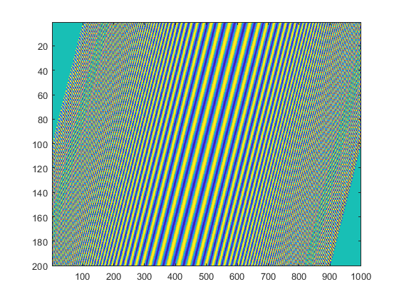
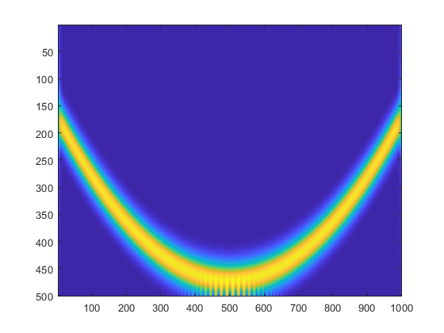
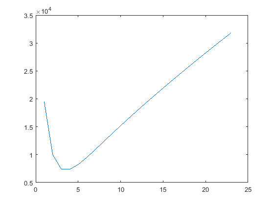
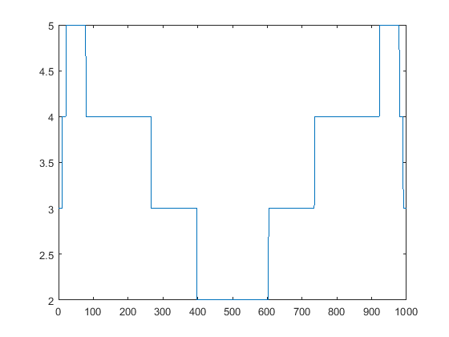
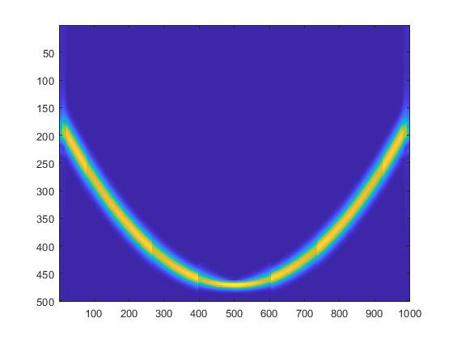

# Adaptive-STFT
Adaptive short-time Fourier transform
### **Signal Definition**:

### **Time-Frequency Transform**

### **Optimization**: 

### **Instantaneous window width**: 

### **Adaptive short-time Fourier transform**: 

### **Reference**: 
A. Gholami, "Sparse Time–Frequency Decomposition and Some Applications," in IEEE Transactions on Geoscience and Remote Sensing, vol. 51, no. 6, pp. 3598-3604, June 2013, doi: 10.1109/TGRS.2012.2220144.
https://doi.org/10.1109/TGRS.2012.2220144
